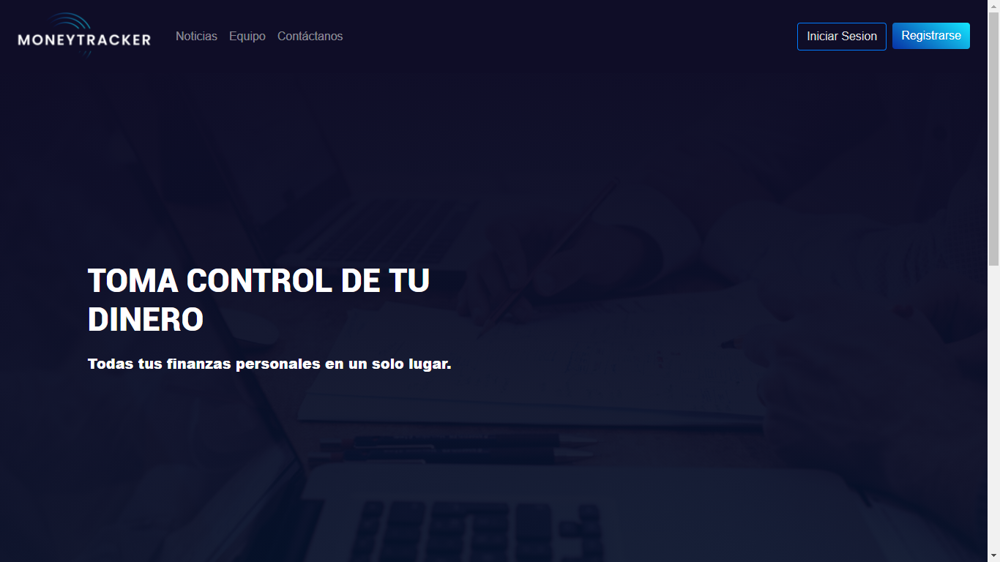
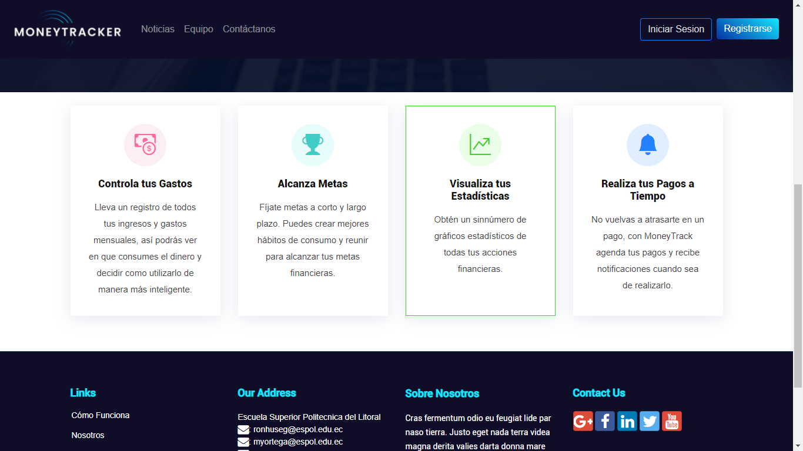

# proyecto_DAWM
Este es el proyecto de Desarrollo de Aplicaciones Web y Moviles, construido bajo con un framework front-end llamado Bootstrap.
### Elaborado por 🛠️: 
* *Ronny Segura*
* *Cesar Carlier*
* *Hayleen Carrillo*
* *Milen Ortega*
## Despues de Clonar 🚀
intale las dependencias
``` 
npm install
```
ejecute el proyecto
``` 
npm start
```
## Recomendaciones 📋
Se intalaron dependencias
``` 
npm install lite-server bootstrap bootstrap-social popper.js --save-dev
npm install htmlmin jquery popper
```

## Avance ⚙️

Barra de Navegación y sección Hero de la página principal



Sección de servicios de la página principal



Footer


Logo de MoneyTrack


