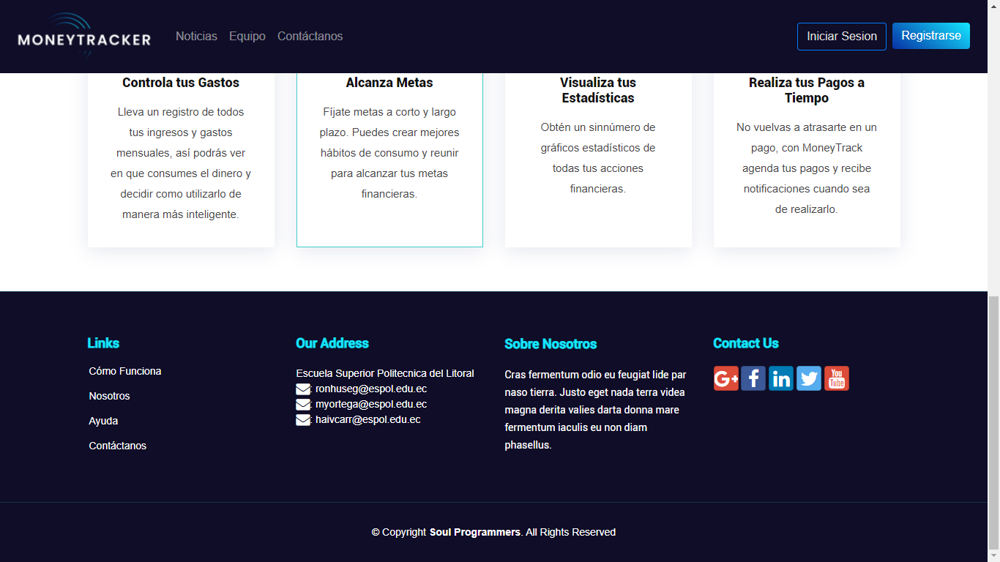

# proyecto_DAWM
Este es el proyecto de Desarrollo de Aplicaciones Web y Moviles
## Despues de Clonar
intale las dependencias
``` 
npm install
```
ejecute el proyecto
``` 
npm start
```
## Recomendaciones
Se intalaron dependencias
``` 
npm install lite-server bootstrap bootstrap-social popper.js --save-dev
npm install htmlmin jquery popper
```

## Avance

Barra de Navegación y sección Hero de la página principal


Sección de servicios de la página principal


Footer



Logo de MoneyTrack


